# 🤖 Mahiru PPOB Bot
### *Framework Bot WhatsApp untuk Transaksi PPOB Otomatis*

<div align="center">


</div>

---

## 🌟 Sekilas Tentang Mahiru PPOB

**Mahiru PPOB** adalah framework bot WhatsApp yang canggih dan mudah digunakan, dirancang khusus untuk mengotomatisasi transaksi **PPOB (Payment Point Online Bank)** melalui integrasi dengan **API Atlantic**. Bot ini memungkinkan Anda menjalankan layanan pembayaran digital langsung dari WhatsApp dengan sistem yang aman dan terpercaya.

> 💡 **Keunggulan Utama**: Otomatisasi penuh, integrasi seamless, dan antarmuka yang user-friendly

---

## 🎯 Fitur Utama

<table>
<tr>
<td width="50%">

### 🔧 **Fitur Teknis**
- ✅ Integrasi menggunakann API Atlantic
- ✅ Sistem keamanan Transaksi dari atlantic  
- ✅ Monitoring transaksi real-time
- ✅ Error handling yang robust
- ✅ Logging sistem yang komprehensif

</td>
<td width="50%">

### 🎨 **Fitur Pengguna**
- ✅ Interface WhatsApp yang intuitif
- ✅ Response time yang cepat
- ✅ Notifikasi status transaksi otomatis
- ✅ Multi-layanan PPOB
- ✅ Sistem feedback yang interaktif

</td>
</tr>
</table>

---

## 🖼️ Preview Interface

<div align="center">


*Tampilan interface bot dalam percakapan WhatsApp*
</div>

---

## 🏗️ Arsitektur Sistem

```mermaid
graph LR
    A[👤 Pengguna WhatsApp] --> B[🤖 Mahiru Bot]
    B --> C[🔗 API Atlantic]
    C --> D[💳 Sistem PPOB]
    D --> C
    C --> B
    B --> A
    
    style A fill:#e1f5fe
    style B fill:#f3e5f5
    style C fill:#e8f5e8
    style D fill:#fff3e0
```



**Alur Kerja:**
1. **Input** - Pengguna mengirim perintah melalui WhatsApp
2. **Processing** - Bot memproses dan meneruskan ke API Atlantic
3. **Execution** - API Atlantic mengeksekusi transaksi
4. **Response** - Hasil dikembalikan ke pengguna melalui bot

---

## 🚀 Panduan Instalasi Lengkap

### 📋 **Fase 1: Persiapan Kredensial Atlantic API**

<details>
<summary><b>🔑 Langkah 1: Registrasi & Upgrade Akun H2H</b></summary>

#### **1.1 Registrasi Akun Dasar**
```bash
🌐 Web: https://m.atlantic-pedia.co.id/
📝 Persyaratan Pendaftaran:
   ├── Email valid / aktif
   ├── Nomor telepon aktif
   ├── Data identitas lengkap
   └── Verifikasi email
```

#### **1.2 Pengajuan Upgrade H2H**
```yaml
📍 Lokasi: Profile → Upgrade Akun H2H
📋 Data yang diperlukan:
  - Penggunaan API: "Bot Transaksi WhatsApp Otomatis"
  - URL/Nomor Bot: "Nomor WhatsApp bot Anda"
  - Deskripsi: "Bot PPOB otomatis menggunakan API Atlantic"
  
⏱️ Estimasi Proses: 1-3 hari kerja
```

<div align="center">

</div>

</details>

<details>
<summary><b>🔐 Langkah 2: Pengambilan API Key</b></summary>

#### **2.1 Akses Web H2H Atlantic**
```bash
🌐 URL: https://atlantich2h.com/
👤 Login: Gunakan akun h2h Atlantic Pedia yang sudah diupgrade dan dikirimkan ke email
```

#### **2.2 Ambil Kredensial API**
```yaml
📍 Menu: Pengaturan API
🔑 Yang perlu disimpan:
  - API Key: "Kunci autentikasi utama"
  
⚠️  PENTING: Simpan kredensial di tempat yang aman!
```

<div align="center">

</div>

#### **2.3 Konfigurasi Whitelist IP**
```yaml
🛡️ Keamanan IP:
  - Development: "0.0.0.0" (semua IP)
  - Production: "IP_SERVER_ANDA" (rekomendasi)
```

</details>

---

### ⚡ **Fase 2: Instalasi & Konfigurasi Bot**

<details>
<summary><b>📦 Langkah 1: Setup Environment</b></summary>

#### **Prasyarat Sistem**
```yaml
💻 Requirements:
  - Node.js: v16.x atau lebih tinggi
  - NPM: Latest version
  - Git: Latest version
  - OS: Linux/Windows/macOS
  - RAM: Minimum 1GB
  - Storage: Minimum 1GB
```

#### **Verifikasi Installation**
```bash
# Cek versi Node.js
node --version

# Cek versi NPM
npm --version

# Cek versi Git
git --version
```

</details>

<details>
<summary><b>📥 Langkah 2: Clone & Setup Project</b></summary>

#### **Clone Repository**
```bash
# Clone project dari GitHub
git clone https://github.com/Liwirya/Mahiru-PPOB.git

# Masuk ke direktori project
cd Mahiru-PPOB

# Cek isi direktori
ls -la
```

#### **Install Dependencies**
```bash
# Install semua package yang diperlukan
npm install

# Verifikasi instalasi
npm list --depth=0
```

#### **Output yang diharapkan:**
```
├── @whiskeysockets/baileys@latest
├── axios@latest
├── chalk@latest
├── moment@latest
├── node-cron@latest
└── qrcode-terminal@latest
```

</details>

<details>
<summary><b>⚙️ Langkah 3: Konfigurasi Bot</b></summary>

#### **Edit File Konfigurasi**
```javascript
// 📄 File: settings.js

// 🔑 KONFIGURASI API ATLANTIC
const apikeyAtlantic = "4Davk3CWkdZ2xxxx"; // ⚠️ GANTI DENGAN API KEY ANDA

Ketik *menu* untuk memulai transaksi!
`;
```

#### **Konfigurasi Environment Variables**
```bash
# Buat file .env (opsional)
touch .env

# Tambahkan konfigurasi
echo "ATLANTIC_API_KEY=your_api_key_here" >> .env
echo "OWNER_NUMBER=628xxxx" >> .env
echo "BOT_NAME=Mahiru PPOB Bot" >> .env
```

</details>

<details>
<summary><b>🚀 Langkah 4: Menjalankan Bot</b></summary>

#### **Start Bot**
```bash
# Jalankan bot
npm start

# Atau dengan PM2 (untuk production)
npm install -g pm2
pm2 start index.js --name "mahiru-bot"
```

#### **Output Sukses:**
```
📞 Masukan nomor whatsapp anda:

🛜 Your pairing code: xxxx-xxxx

⚠️ Bila gk muncul notifikasi, bisa hubung ke wa secara manual, atau merubah isPairingcode = true ganti jadi false, sehingga memberikan qr code
```
---

## 🛠️ Troubleshooting & FAQ

<details>
<summary><b>❓ Frequently Asked Questions</b></summary>

### **Q: Proses upgrade H2H lebih dari 3 hari, bagaimana?**
**A:** Hubungi CS Atlantic Pedia melalui:
- 📞 WhatsApp: [+6285155081449]
- 📧 Email: support@atlantic-pedia.co.id
- Sertakan username/email untuk mempercepat proses

### **Q: Bot menampilkan "Authentication Failed"?**
**A:** Kemungkinan penyebab:
```yaml
🔍 Troubleshooting:
  1. ❌ API Key salah/belum aktif
     ✅ Cek ulang API Key di portal H2H
  
  2. ❌ Akun belum status H2H
     ✅ Pastikan upgrade sudah diapprove
  
  3. ❌ Whitelist IP belum diatur
     ✅ Set IP ke 0.0.0.0 atau IP spesifik
```

### **Q: Bot tidak merespon pesan?**
**A:** Langkah debugging:
```bash
# Cek logs bot
tail -f logs/bot.log

# Cek koneksi WhatsApp
pm2 status mahiru-bot

# Restart bot
pm2 restart mahiru-bot
```

### **Q: Apakah bot ini gratis?**
**A:** 
```yaml
💰 Biaya:
  - Framework Bot: ✅ GRATIS (Open Source)
  - Biaya Transaksi: 💳 Sesuai tarif Atlantic
  - Server Hosting: 🖥️ Biaya server sendiri
```

</details>

<details>
<summary><b>🐛 Common Errors & Solutions</b></summary>

### **Error 1: "Module not found"**
```bash
# Solution
rm -rf node_modules
rm package-lock.json
npm cache clean --force
npm install
```

### **Error 2: "Port already in use"**
```bash
# Cari proses yang menggunakan port
lsof -ti:3000

# Kill proses
kill -9 PID_NUMBER

# Atau gunakan port lain
PORT=3001 npm start
```

### **Error 3: "QR Code not generated"**
```bash
# Clear session data
rm -rf session/
npm start
```

</details>

---

## 🔐 Security & Best Practices

### **🛡️ Keamanan API**
- ✅ Simpan API Key di environment variables
- ✅ Gunakan HTTPS untuk semua request
- ✅ Implementasi rate limiting
- ✅ Whitelist IP address
- ✅ Regular security audit

### **🔄 Backup & Recovery**
```bash
# Setup automated backup
crontab -e

# Add backup script (daily at 2 AM)
0 2 * * * /path/to/backup.sh
```

---

## 🚀 Deployment Options

<details>
<summary><b>☁️ Cloud Deployment</b></summary>

### **VPS/Dedicated Server**
```yaml
💻 Recommended Specs:
  - CPU: 2 vCPU
  - RAM: 2GB
  - Storage: 20GB SSD
  - Bandwidth: Unlimited
  - OS: Ubuntu 20.04 LTS
```

### **Cloud Providers**
- 🌊 **Digital Ocean**: $10/month droplet
- ☁️ **AWS EC2**: t2.micro (free tier)
- 🌐 **Google Cloud**: e2-micro (free tier)
- 🔷 **Azure**: B1s instance

</details>

<details>
<summary><b>🐳 Docker Deployment</b></summary>

```dockerfile
# Dockerfile
FROM node:16-alpine

WORKDIR /app
COPY package*.json ./
RUN npm install --production

COPY . .
EXPOSE 3000

CMD ["npm", "start"]
```

```bash
# Build & Run
docker build -t mahiru-bot .
docker run -d -p 3000:3000 --name mahiru-bot mahiru-bot
```

</details>

---

## 🤝 Contributing & Development

### **🔧 Development Setup**
```bash
# Fork repository
git clone https://github.com/Liwirya/Mahiru-PPOB.git

# Create feature branch
git checkout -b feature/new-feature

# Make changes and commit
git commit -m "Add: new feature description"

# Push and create PR
git push origin feature/new-feature
```

### **📝 Code Standards**
- ✅ ESLint configuration
- ✅ Prettier code formatting
- ✅ JSDoc documentation
- ✅ Unit testing with Jest

---

## 📞 Support & Community

<div align="center">

### 🌟 **Bergabung dengan Komunitas Mahiru**

<table>
<tr>
<td align="center" width="33%">

### 💬 **WhatsApp Community**
[](https://whatsapp.com/channel/0029VadHRVCEQIagiLHVJV0d)

Diskusi real-time dengan komunitas

</td>
<td align="center" width="33%">

### 📧 **Email Support**
[](mailto:wiraliwirya@gmail.com)

Support teknis & partnership

</td>
<td align="center" width="33%">

### 🐛 **Issue Tracker**
[](https://github.com/Liwirya/Mahiru-PPOB/issues)

Bug reports & feature requests

</td>
</tr>
</table>

</div>

---

## 📄 License & Credits

<div align="center">

### 📜 **MIT License**

```
Copyright (c) 2025 Liwirya x Mahiru

Permission is hereby granted, free of charge, to any person obtaining a copy
of this software and associated documentation files (the "Software"), to deal
in the Software without restriction, including without limitation the rights
to use, copy, modify, merge, publish, distribute, sublicense, and/or sell
copies of the Software, and to permit persons to whom the Software is
furnished to do so, subject to the following conditions:

The above copyright notice and this permission notice shall be included in all
copies or substantial portions of the Software.
```

### 🙏 **Kontribusi**

**Terimakasih:**
- 🌊 **Atlantic Pedia** - API Provider
- 📱 **Baileys** - WhatsApp Web API
- 🚀 **Node.js Community** - Runtime environment
- ❤️ **Open Source Community** - Continuous support

---

**Dibuat oleh [Liwirya x Mahiru](https://github.com/Liwirya) © 2025**

*All rights reserved. This project is licensed under MIT License.*

</div>

---

<div align="center">

### ⭐ **Jika project ini membantu, berikan star di GitHub!**

[](https://github.com/Liwirya/Mahiru-PPOB/stargazers)
[](https://github.com/Liwirya/Mahiru-PPOB/network)

</div>
